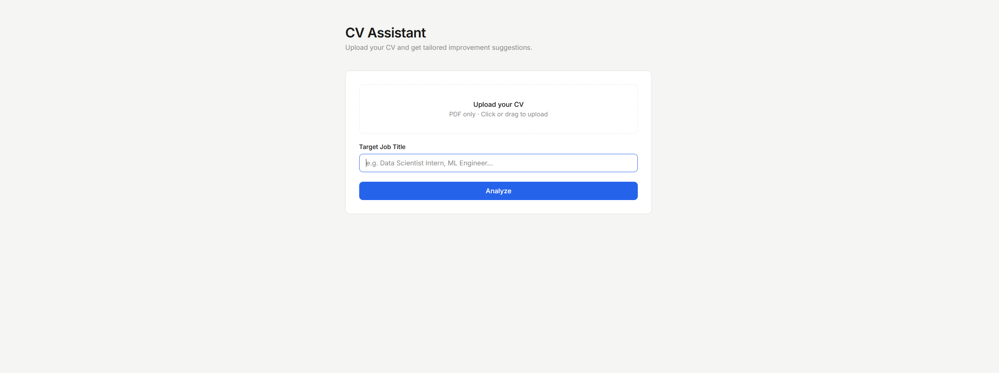
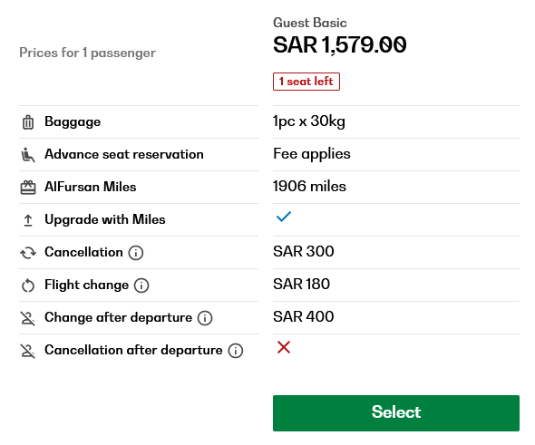

# CV Assistant

AI-powered CV improvement tool that analyzes your CV against real job requirements and suggests targeted improvements.



## How it works
```
Analyzer → Job Search → Gap Analysis → Improver → Validator
```

1. **Analyzer** — extracts skills, experience, and projects from your CV
2. **Job Search** — searches real job requirements using DuckDuckGo
3. **Gap Analysis** — compares your CV against job requirements  
4. **Improver** — writes targeted improvement suggestions
5. **Validator** — reviews quality and loops if score < 80

## LangSmith Tracing

Full pipeline visibility across all agents.



## Tech Stack

- **LangGraph** — multi-agent workflow orchestration
- **Ollama** (llama3.1:8b) — local LLM inference
- **FastAPI** — backend API
- **PyMuPDF** — PDF parsing
- **DuckDuckGo Search** — real-time job requirements

## Project Structure
```
cv-assistant/
├── agents.py        # LangGraph pipeline
├── main.py          # FastAPI backend
├── static/
│   └── index.html   # Frontend
├── requirements.txt
└── README.md
```

## Usage

1. Upload your CV as PDF
2. Enter your target job title
3. Click Analyze
4. Get targeted improvement suggestions
